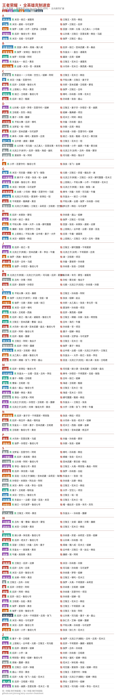

# 王者荣耀 全英雄克制速查 / Honor of Kings Hero Counter Cheatsheet

> 单页手机版 PNG / HTML，覆盖全部 130+ 英雄的克制 (counter) 与被克制 (countered by) 关系。
> **数据来自 pvp.qq.com 官方接口 (实时拉取)**，通过反向推导扩展到每英雄 ≥3 克制 + ≥3 被克制。
> 每周一自动刷新数据，GitHub Actions 重建图片。

**关键词 / Keywords:** 王者荣耀 · 王者营地 · 克制 · 反制 · cheatsheet · 速查 · honor of kings · arena of valor · hero counter · matchup · wzry · 英雄克制表

---

## 预览 / Preview



完整 PNG: [`output/cheatsheet_mobile.png`](output/cheatsheet_mobile.png)
HTML 版: [`output/cheatsheet_mobile.html`](output/cheatsheet_mobile.html)

---

## 这是什么 / What is this

打游戏选英雄前看一眼对面阵容，瞄一下表就知道：
- **「克」**: 你这个英雄能压制谁（你打他容易）
- **「怕」**: 你这个英雄怕谁（被针对就难受）

每个英雄至少给出 3 个克制 + 3 个被克制对象，按拼音 A-Z 分组。

---

## 项目结构 / Layout

```
.
├── data/
│   ├── heroes.json       # 官方英雄列表 (来自 pvp.qq.com)
│   └── counters.json     # 克制关系数据 (自动拉取 + 反向推导)
├── src/
│   ├── fetch_data.py     # 从 pvp.qq.com 拉取实时克制数据
│   ├── render_html.py    # 渲染手机版 HTML
│   └── render_png.py     # 渲染手机版 PNG (Pillow, 无浏览器依赖)
├── output/
│   ├── cheatsheet_mobile.png
│   └── cheatsheet_mobile.html
├── .github/workflows/build.yml  # data/src 变更自动重建并 commit
└── requirements.txt
```

---

## 本地构建 / Build locally

```bash
pip install -r requirements.txt
python src/render_html.py
python src/render_png.py
```

需要系统安装中文字体 (Linux: `sudo apt install fonts-noto-cjk`).

---

## 数据流 / Data pipeline

```
pvp.qq.com 官方英雄详情页
        │
        ▼
qing762.is-a.dev/api/wangzhe  (第三方公开 API, 实时爬取)
        │
        ▼
src/fetch_data.py  ─── 拉取 130 英雄各 2 克制 + 2 被克制 (官方原始)
        │               ├── 反向推导: A克B → B被A克
        │               └── 同类补全: 同定位英雄高频克制对象
        ▼
data/counters.json  ─── 每英雄 ≥3 克制 + ≥3 被克制
        │
        ▼
src/render_png.py + render_html.py → output/
```

每周一 GitHub Actions 自动跑一次全流程，也可手动 `workflow_dispatch`。

**手动刷新：**
```bash
python src/fetch_data.py   # 拉最新数据
python src/render_png.py   # 重建 PNG
python src/render_html.py  # 重建 HTML
```

---

## 数据说明 / Data caveat

- **英雄列表**: 来自 `https://pvp.qq.com/web201605/js/herolist.json`，实时官方数据
- **克制关系**: 来自 pvp.qq.com 官方英雄详情页（每英雄 2+2），通过反向推导 + 同定位补全扩展到 ≥3+3
- 数据每周自动刷新，跟随官方更新
- 不是王者营地 APP 里的「巅峰赛分段」数据（那个需要登录态），但来源一致（都是腾讯官方）

---

## 自动化 / Automation

`.github/workflows/build.yml`：
- `data/` 或 `src/` 变更 → 拉取最新数据 → 重建图片 → commit
- **每周一 UTC 03:00 定时刷新**（跟随版本更新）
- 也可手动触发 (`workflow_dispatch`)

---

## License

MIT
